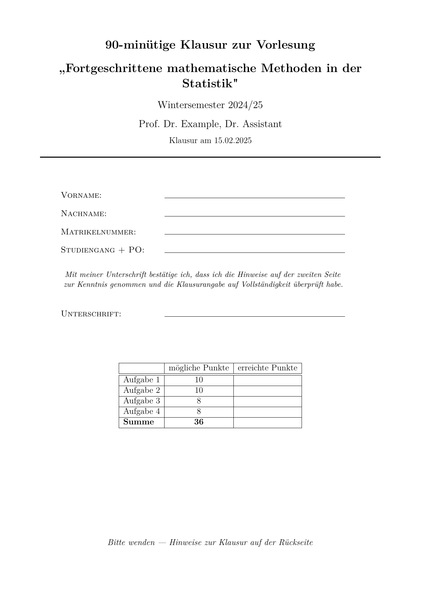
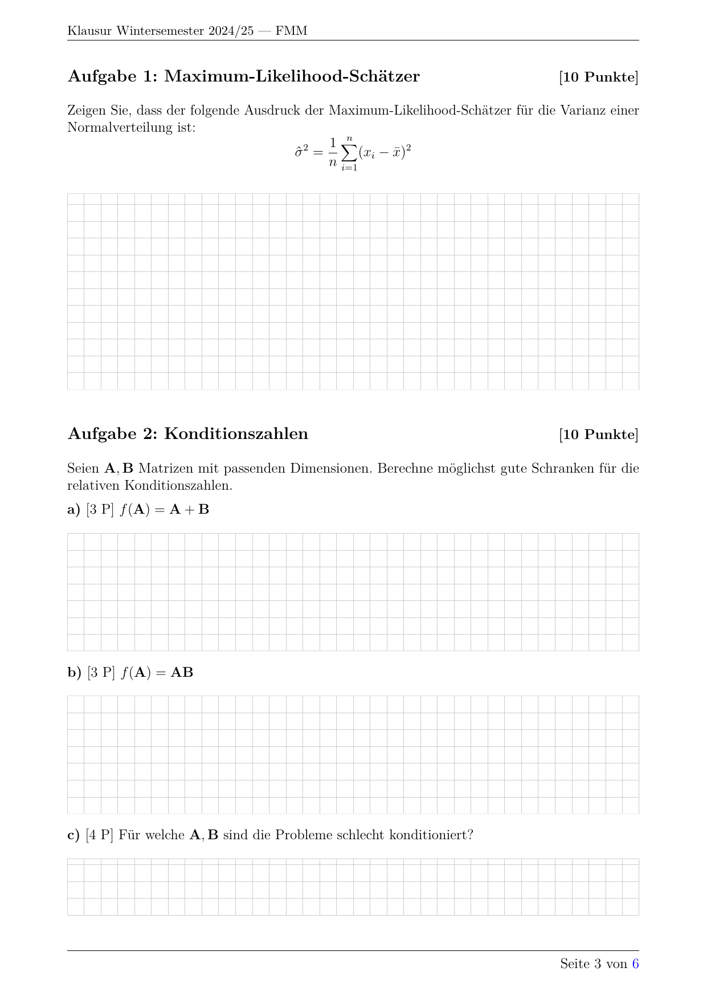

# LMU Munich Exam Template

A Quarto extension for creating professional PDF exam papers (Klausuren) for LMU Munich. Features automatic exercise numbering, points tracking from solution markers, automatic answer field generation, and bilingual support (German/English).

## Features

- **Cover page** with student information fields and auto-generated points table
- **Customizable instructions page** via included child document
- **Auto-numbered exercises** via `##` headings (with optional titles)
- **Auto-numbered sub-exercises** via `###` headings (a, b, c...)
- **Auto-points tracking** from `\p`, `\hp`, `\pp` markers in solution blocks
- **Auto-generated answer fields** - solution blocks become boxes in exam mode
- **Grid or blank answer fields** - `grid-paper: true/false` for 5mm grid or blank boxes
- **Styled solution blocks** with visual left border in solution mode
- **Solution toggle** - render exam sheet or solution sheet from same source
- **Bilingual support** - German (`exam-lang: de`) or English (`exam-lang: en`)
- **Configurable extra pages** - set number of blank/grid pages at end

## Installation

```bash
quarto add fabian-s/quarto-exam
```

Or clone the repository and copy `_extensions/exam/` to your project.

## Usage

### Basic Document Structure

```markdown
---
semester: "Winter 2024/25"
course: "Advanced Statistical Methods"
course-short: "ASM"
instructor: "Prof. Dr. Name"
exam-date: "15.02.2025"
duration: 90
exam-lang: en
grid-paper: true
extra-pages: 2
format: exam-pdf
---



## Maximum Likelihood Estimator

Question text here.

::: {.solution box=4}
**Solution:**

First step of the solution. \p
Second step worth half a point. \hp
Final answer worth double points. \pp
:::

## Condition Numbers

Introduction text for exercise with sub-exercises.

###

$f(\mathbf{A}) = \mathbf{A} + \mathbf{B}$

::: {.solution box=2.5}
Solution for part a). \p \pp
:::

###

$f(\mathbf{A}) = \mathbf{A} \mathbf{B}$

::: {.solution}
Solution for part b) - answer field auto-sized. \p \pp
:::
```

### Rendering

```bash
# Exam sheet (answer boxes, no solutions)
quarto render exam.qmd -M solution:false -o exam.pdf

# Solution sheet (solutions shown, no boxes)
quarto render exam.qmd -M solution:true -o solutions.pdf

# Blank answer boxes (no grid lines)
quarto render exam.qmd -M solution:false -M grid-paper:false -o exam.pdf

# English exam
quarto render exam.qmd -M solution:false -M exam-lang:en -o exam-en.pdf

# No extra pages at end
quarto render exam.qmd -M solution:false -M extra-pages:0 -o exam.pdf
```

| Cover Page | Exam Mode | Solution Mode |
|:----------:|:---------:|:-------------:|
|  |  |  |

### Solution Blocks and Answer Fields

Solution blocks serve dual purpose:
- **Exam mode** (`-M solution:false`): Replaced with answer field box
- **Solution mode** (`-M solution:true`): Displayed with styled box

**The `box` attribute:**
```markdown
::: {.solution box=4}    # 4cm answer field in exam mode
...
:::

::: {.solution}          # Auto-sized based on content
...
:::
```

If `box` is omitted, the height is auto-estimated from the solution content (~0.5cm per line, minimum 2cm).

**Grid vs Blank:**
- `grid-paper: true` (default) - Answer fields have 5mm grid lines
- `grid-paper: false` - Answer fields are blank (just grey border)
- Extra pages at end match the grid setting

Answer fields automatically break across pages if they're too tall to fit.

**Disabling answer fields:** Set `answerfields: false` in front matter to omit all answer boxes (useful when students answer on separate paper).

### Exercise and Sub-Exercise Syntax

**Exercises (`##`):**
- Any `##` heading becomes an exercise, auto-numbered 1, 2, 3...
- Title is optional: `##` alone → "Exercise 1", `## Title` → "Exercise 1: Title"
- Points shown flush right as `[X Points]`

**Sub-exercises (`###`):**
- `###` on its own line creates a sub-exercise, auto-numbered a), b), c)...
- The paragraph following `###` becomes the question text
- Sub-exercise numbering resets with each new exercise

### Points System

Points are automatically calculated from markers inside `::: {.solution}` blocks:

| Marker | Points | Display (in solution mode) |
|--------|--------|---------------------------|
| `\p`   | 1      | ^[1P]                     |
| `\hp`  | 0.5    | ^[½P]                     |
| `\pp`  | 2      | ^[2P]                     |

- Markers work in both text and math mode
- Exercise points = sum of sub-exercise points (or direct points if no sub-exercises)
- Points table on cover page is auto-generated

### YAML Front Matter Fields

| Field | Description | Default |
|-------|-------------|---------|
| `semester` | e.g., "Winter 2024/25" | required |
| `course` | Full course title | required |
| `course-short` | Short name for headers | falls back to `course` |
| `instructor` | Instructor name(s) | required |
| `exam-date` | Exam date (any format) | required |
| `duration` | Duration in minutes | required |
| `exam-lang` | `de` or `en` | `de` |
| `grid-paper` | Grid lines in answer fields | `true` |
| `extra-pages` | Extra pages at end | `2` |
| `answerfields` | Show answer boxes | `true` |
| `format` | Must be `exam-pdf` | required |

### Language Support

Set `exam-lang: en` for English or `exam-lang: de` (default) for German.

This affects:
- Cover page layout and text
- Exercise labels ("Aufgabe" vs "Exercise")
- Points labels ("Punkte" vs "Points")
- Points table headers
- Page header/footer
- Extra page text

### Commands

| Command | Description |
|---------|-------------|
| `##` or `## Title` | Creates auto-numbered exercise heading |
| `###` | Creates auto-numbered sub-exercise (a, b, c...) |
| `::: {.solution}` | Solution block with auto-sized answer field |
| `::: {.solution box=X}` | Solution block with X cm answer field |
| `\p`, `\hp`, `\pp` | Point markers (1, 0.5, 2 points) |
| `\examexercisecount{}` | Total number of exercises |
| `\examtotalpoints{}` | Total points |

### LaTeX Macros

| Macro | Description |
|-------|-------------|
| `\examsemester` | Semester value |
| `\examcourse` | Full course name |
| `\examcourseshort` | Short course name |
| `\examinstructor` | Instructor name |
| `\examdate` | Exam date |
| `\examduration` | Duration in minutes |
| `\examexercisecount` | Number of exercises |
| `\examtotalpoints` | Total points |
| `\exampointstable` | Points table |
| `\examanswerfield{X}` | Answer field of X cm height |

### Customizing Instructions

Create `hinweise.qmd` (German) or `instructions.qmd` (English) in your project:

```markdown
\thispagestyle{empty}

# Exam Instructions {.unnumbered .unlisted}

---

- This exam consists of **\examexercisecount{} exercises** with **\examtotalpoints{} points**.
- Time limit: **\examduration{} minutes**.
- ... (your exam rules)

\vfill
\newpage
```

## File Structure

```
your-exam/
├── _extensions/exam/     # The extension (copy from this repo)
│   ├── _extension.yml
│   ├── aufgabe.lua       # Lua filter for auto-numbering and points
│   ├── packages.tex      # LaTeX preamble
│   ├── deckblatt.tex     # German cover page
│   └── coverpage.tex     # English cover page
├── hinweise.qmd          # German exam instructions
├── instructions.qmd      # English exam instructions
└── exam.qmd              # Your exam document
```

## Requirements

- Quarto >= 1.4.0
- pdfLaTeX with packages: fancyhdr, lastpage, tikz, tcolorbox

## Example Output

The template generates:
1. **Page 1**: Cover page with student fields and points table
2. **Page 2**: Exam instructions (from hinweise.qmd or instructions.qmd)
3. **Pages 3+**: Exam questions with answer boxes (exam) or styled solutions (solution sheet)
4. **Final pages**: Extra pages for additional work (grid or blank, configurable)

## Credits

Based on the [Monash Exam Template](https://github.com/quarto-monash/exam) by Rob J Hyndman.

Adapted for LMU Munich by Claude on behalf of Fabian Scheipl.

## License

CC0 - Public Domain
